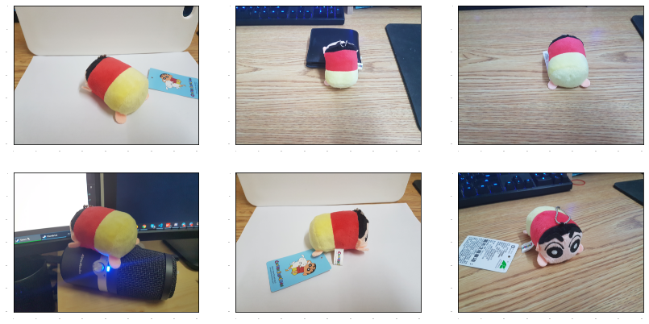
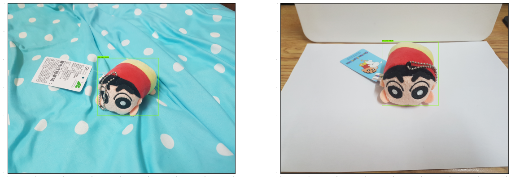

# Object Detection with Tensorflow Object Detection API

This Project is based on the [Fine-tune a pre-trained detector in eager mode on custom data notebook](https://github.com/tensorflow/models/blob/master/research/object_detection/colab_tutorials/eager_few_shot_od_training_tf2_colab.ipynb) in Tensorflow Object Detection API and [Training Custom Object Detector tutorial](https://tensorflow-object-detection-api-tutorial.readthedocs.io/en/latest/training.html).

In this jupyter notebook, we first download and restore object detection head of the pre-trained model (SSD Resnet-50 in this example). Then, we fine-tune the classification head with our images. I already took some photos of my cute Crayon Shin-Chan stuffed toy. Feel free to use them if you don't have your own images.

## Preview
### Ground Truth

### Predictions
This prediction result comes from a model using resnet-50 as base network and trained 20 iterations. For more detailed hyper-parameter settings, please check the notebook.



### Annotation XML file

This is one sample of annotation XML file.
```
<annotation>
	<folder>train</folder>
	<filename>20201115_204553.jpg</filename>
	<path>/home/iceman126/dl_projects/Object-Detection-with-TF2/images/train/20201115_204553.jpg</path>
	<source>
		<database>Unknown</database>
	</source>
	<size>
		<width>4032</width>
		<height>3024</height>
		<depth>3</depth>
	</size>
	<segmented>0</segmented>
	<object>
		<name>stuffed toy</name>
		<pose>Unspecified</pose>
		<truncated>0</truncated>
		<difficult>0</difficult>
		<bndbox>
			<xmin>1552</xmin>
			<ymin>992</ymin>
			<xmax>2618</xmax>
			<ymax>2021</ymax>
		</bndbox>
	</object>
</annotation>
```

## Steps
### Perpare the Dataset (Optional)
1. If you want to use your own custom data, you can use `labelimg` package to label your images. Here I provide the simplest the way to install the package, for other ways to do so please check [here](https://tensorflow-object-detection-api-tutorial.readthedocs.io/en/latest/training.html#preparing-the-dataset).
```
pip install labelImg
```
2. Run the program
```
labelImg
# or
labelImg [IMAGE_PATH] [PRE-DEFINED CLASS FILE]
```

3. The annotation xml format should be similar to the format shown above. After labeling the dataset, you should seperate them into training and testing dataset and put them according to file structure in this repo.

### Ready to Go
You can open the jupyter notebook and execute it. The training time should be less than 2 min (with GTX 1080).

## TODO
- [ ] Update the parsing xml function to support multiple objects in single image.
- [ ] Upload images with multiple objects

## Contact me
I'm actively looking for a machine learning engineer position. Please feel free to contact me if you think I'm a fit. Here is my [linkedin](https://www.linkedin.com/in/jinbo-huang). :) 